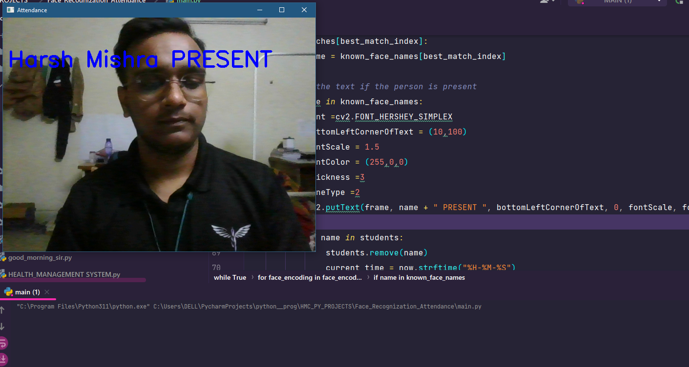

# Face Recognition Attendance System

This is a Python program that utilizes face recognition to create an attendance system. It captures video from the default camera, detects faces, matches them against known faces, and marks attendance for recognized individuals.

## Installation

Before running the program, ensure that the required libraries are installed. You can install them using pip:

pip install face_recognition , 
pip install cmake , 
pip install opencv-python , 
pip install numpy

## Usage

1. Prepare the known faces:
   - Place images of the known faces in the "faces" directory.
   - Make sure each image contains a clear and recognizable face.

2. Run the program:
   - Execute the "main.py" script.
   - The program will use the default camera to capture video and perform face recognition.

3. Attendance recording:
   - Recognized individuals will have their names displayed on the video frame.
   - The program will generate a CSV file with the attendance records for the current date.

4. Exiting the program:
   - Press 'q' to exit the program and stop the video capture.

## Requirements

- Python 3.x
- face_recognition
- cmake
- opencv-python
- numpy

## Credits

This project was developed by HARSH MISHRA.

## SCREENSHOT

