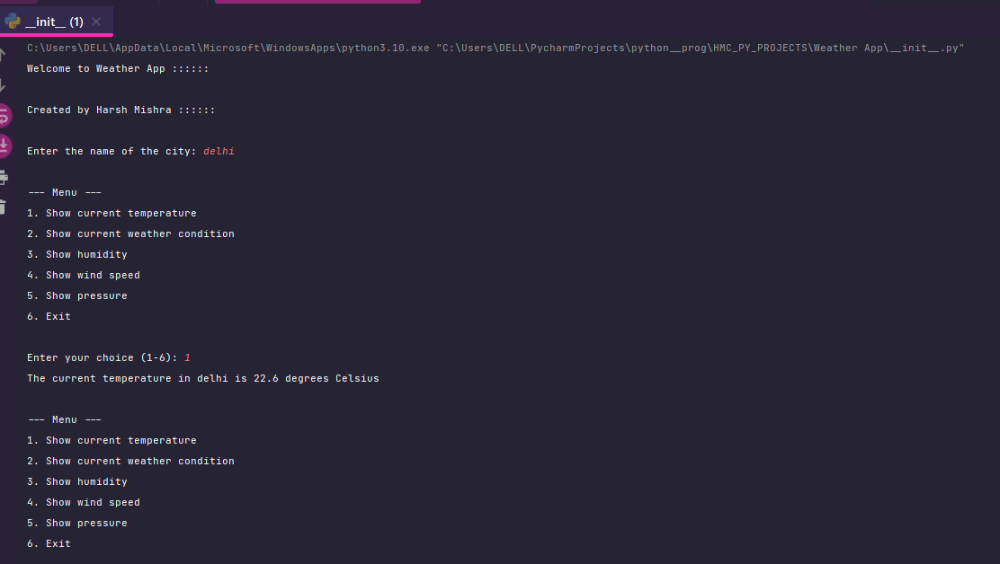
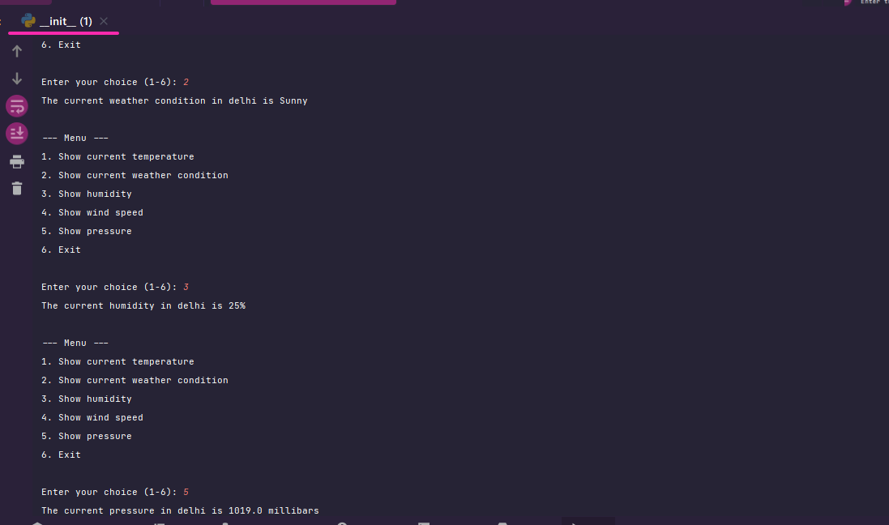
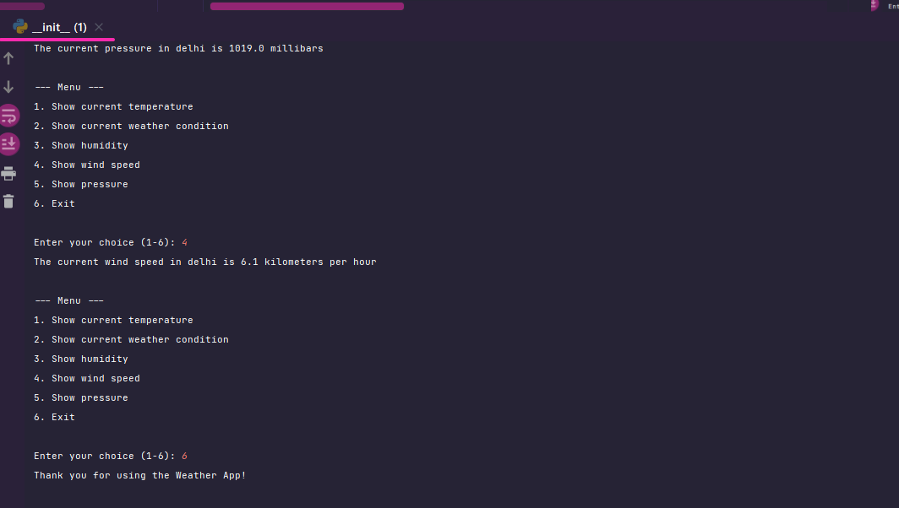

Weather App
Description
The Weather App is a Python-based application that provides real-time weather information for a specified city. It utilizes the WeatherAPI to fetch weather data and offers a user-friendly interface for accessing the current temperature, weather condition, humidity, wind speed, and pressure.

Features
Fetches real-time weather data from the WeatherAPI.
Allows users to select a city and view its weather information.
Provides information on temperature, weather condition, humidity, wind speed, and pressure.
Supports text-to-speech functionality using the pyttsx3 library.
Screenshots

Requirements
Python 3.x
WeatherAPI (API key required)
pyttsx3 library

Credits
This project was developed by [Harsh Mishra]. It utilizes the WeatherAPI (https://weatherapi.com) for retrieving weather data and the pyttsx3 library for text-to-speech functionality.
